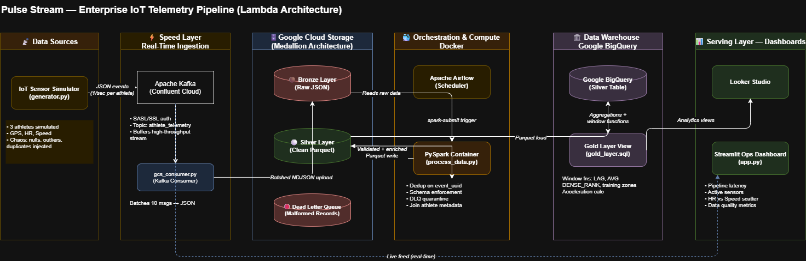
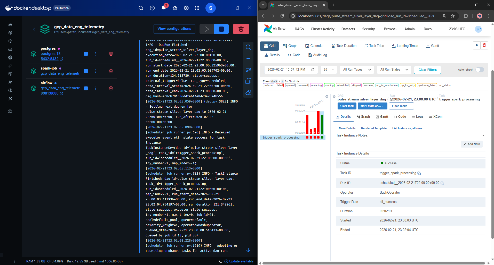
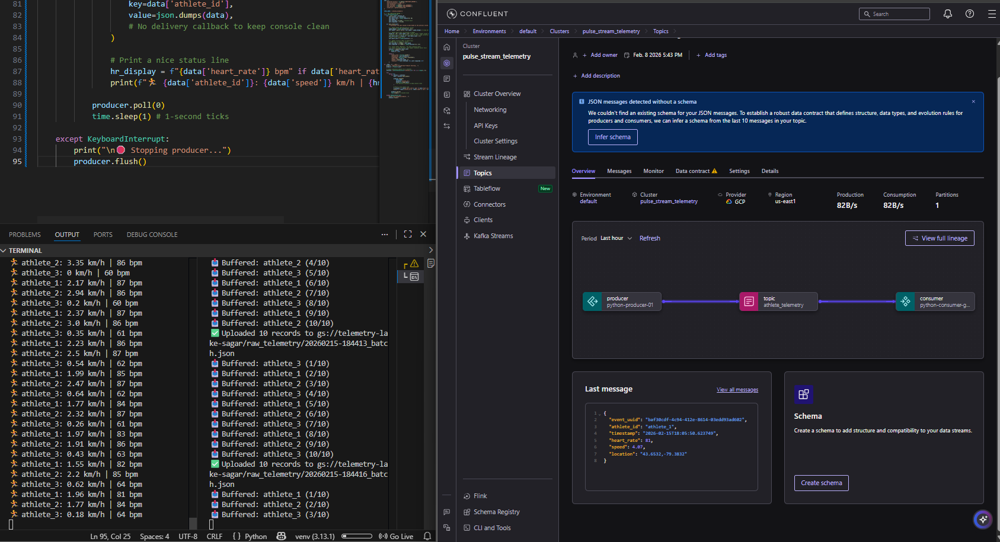
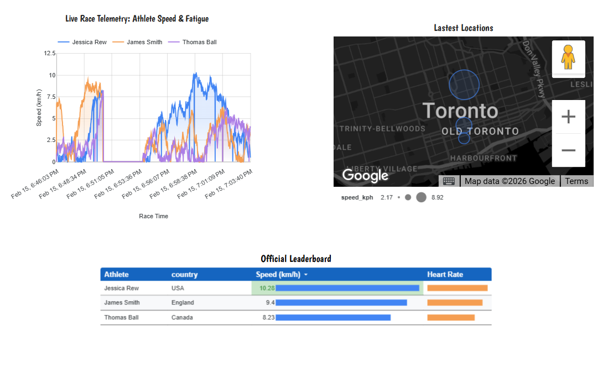

# 🏎️ Pulse Stream: Enterprise IoT Telemetry Pipeline


---

## 📖 Overview

**Pulse Stream** is an end-to-end, fault-tolerant data pipeline built on a **Lambda Architecture**. It simulates a live athletic race by generating high-frequency IoT telemetry (GPS, heart rate, speed) and processes it for both real-time operational monitoring and historical batch analytics.

The project covers the full data engineering lifecycle: ingestion → orchestration → processing → warehousing → dashboarding, with a focus on **fault tolerance** and **data quality enforcement**.

---

## 🏗️ Architecture



---

## ⚙️ How It Works

### 1. Speed Layer — Real-Time Ingestion
- `generator.py` simulates 3 athletes producing live telemetry events (GPS, heart rate, speed) every second, including **intentional data chaos**: null sensor readings (1%), HR outlier spikes (0.5%), and duplicate packets (1%) to stress-test the pipeline.
- Events are published to **Confluent Apache Kafka** using SASL/SSL authentication.
- `gcs_consumer.py` drains the Kafka topic in batches and writes **NDJSON** files to the **Bronze Layer** in Google Cloud Storage.

### 2. Batch Layer — Orchestration & Processing
- **Apache Airflow** (Dockerized) schedules and triggers a `spark-submit` job by reaching across the Docker daemon to the Spark container.
- `process_data.py` (PySpark) reads Bronze data and applies the **Medallion Architecture**:
  - Deduplicates records on `event_uuid`
  - Enforces schema and validates fields
  - **Dead Letter Queue (DLQ):** Malformed records (null heart rate, impossible HR > 220, missing UUIDs) are quarantined to `gs://bucket/dlq/` before cleaning, ensuring zero silent failures
  - Clean records are enriched with athlete metadata and written as **Parquet** to the Silver Layer

### 3. Serving Layer — Analytics & Dashboards
- Silver data is loaded into **Google BigQuery**.
- `gold_layer.sql` creates a BigQuery view using CTEs and window functions (LAG, moving average, DENSE_RANK) to compute athlete acceleration, training zones (Recovery → VO2 Max), and a live leaderboard.
- **Looker Studio** connects to BigQuery for geospatial and historical analytics.
- `app.py` is a **Streamlit** ops dashboard showing pipeline latency, active sensors, data quality metrics, and a Speed vs. Heart Rate scatter plot.

---

## 🗂️ Project Structure

```
├── dags/
│   └── silver_layer_dag.py       # Airflow DAG — triggers PySpark job on schedule
├── src/
│   ├── producer/
│   │   └── generator.py          # IoT sensor simulator with chaos engineering
│   ├── consumer/
│   │   └── gcs_consumer.py       # Kafka → GCS Bronze Layer consumer
│   └── processing/
│       └── process_data.py       # PySpark Medallion transformer + DLQ logic
├── Screenshots/                  # Dashboard UI screenshots
├── app.py                        # Streamlit Ops Dashboard
├── gold_layer.sql                # BigQuery Gold Layer view (window functions)
├── athlete.json                  # Reference data for athlete metadata
├── docker-compose.yaml           # Multi-container: Spark + Airflow + Postgres
├── Dockerfile                    # PySpark container with GCS connector
├── Dockerfile.airflow            # Airflow container with Docker CLI
├── requirements.txt              # Python dependencies
└── .env.example                  # Environment variable template
```

---

## 🚀 Getting Started

### Prerequisites
- Docker & Docker Compose
- A [Confluent Cloud](https://confluent.io) account (free tier works)
- A Google Cloud project with GCS and BigQuery enabled
- GCP service account key with Storage and BigQuery permissions

### Setup

**1. Clone the repo**
```bash
git clone https://github.com/Sagar387/Gcp_data_eng_telemetry.git
cd Gcp_data_eng_telemetry
```

**2. Configure environment variables**
```bash
cp .env.example .env
# Fill in your Confluent Cloud and GCP credentials
```

**3. Add your GCP service account key**
```bash
mkdir keys
cp /path/to/your/gcp-creds.json keys/gcp-creds.json
```

**4. Start all containers**
```bash
docker compose up --build
```

**5. Start the producer and consumer** (in separate terminals)
```bash
python src/producer/generator.py
python src/consumer/gcs_consumer.py
```

**6. Access the dashboards**
- Airflow UI: [http://localhost:8081](http://localhost:8081)
- Streamlit Ops Dashboard: `streamlit run app.py`

---

## 🛠️ Tech Stack

| Layer | Technology |
|---|---|
| Streaming | Apache Kafka (Confluent Cloud) |
| Orchestration | Apache Airflow 2.8 |
| Processing | Apache Spark 3.5 (PySpark) |
| Storage | Google Cloud Storage (GCS) |
| Data Warehouse | Google BigQuery |
| Dashboarding | Looker Studio, Streamlit |
| Containerization | Docker, Docker Compose |
| Language | Python 3.9, SQL |

---

## 🔑 Key Design Decisions

**Why Lambda Architecture?** Separating the speed layer (Kafka for sub-second latency) from the batch layer (PySpark for correctness and throughput) allows the pipeline to serve both real-time ops monitoring and accurate historical analytics from a single source of truth.

**Why a Dead Letter Queue?** Rather than dropping or silently corrupting bad records, the DLQ quarantines them with full fidelity. This means pipeline failures are observable, recoverable, and never propagate downstream into the warehouse.

**Why Docker-in-Docker for Airflow → Spark?** Mounting `/var/run/docker.sock` lets Airflow trigger isolated `spark-submit` jobs as separate containers, keeping orchestration and compute fully decoupled without needing a Kubernetes cluster.

---

## 📸 Screenshots

### Streamlit Ops Dashboard


### Kakfa real time streaming


### Looker Studio — Geospatial Analytics



